# Not Gate
## Circut Board
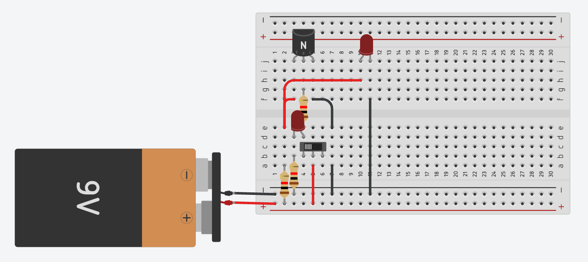
## Wiring Diagram
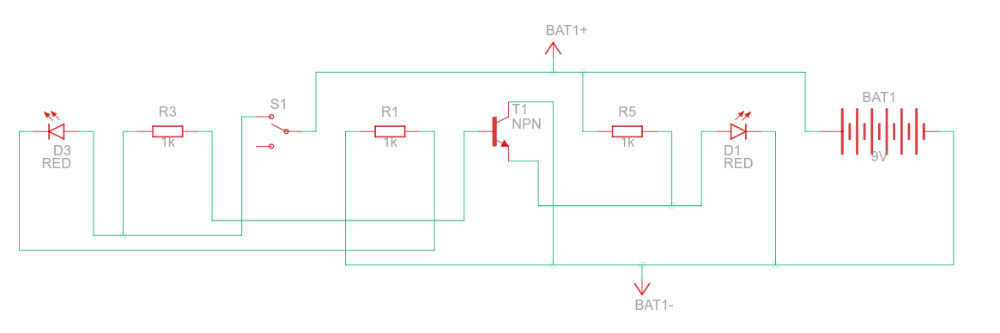
## IRL Circut
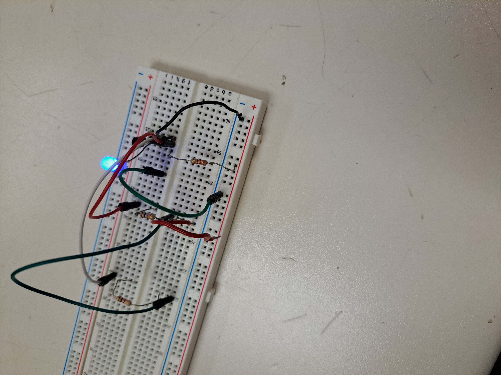
## Demonstration
https://user-images.githubusercontent.com/113391567/223891447-4218629a-2095-40b2-9be5-734db0bb426a.mp4

# And Gate
## Circut Board
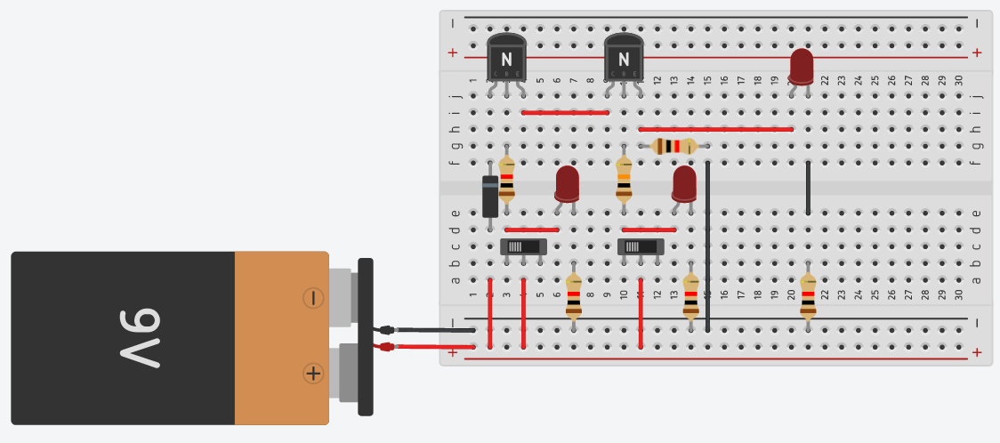
## Wiring Diagram
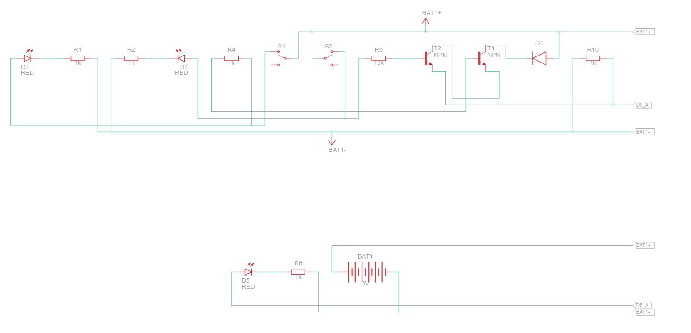
## IRL Circut
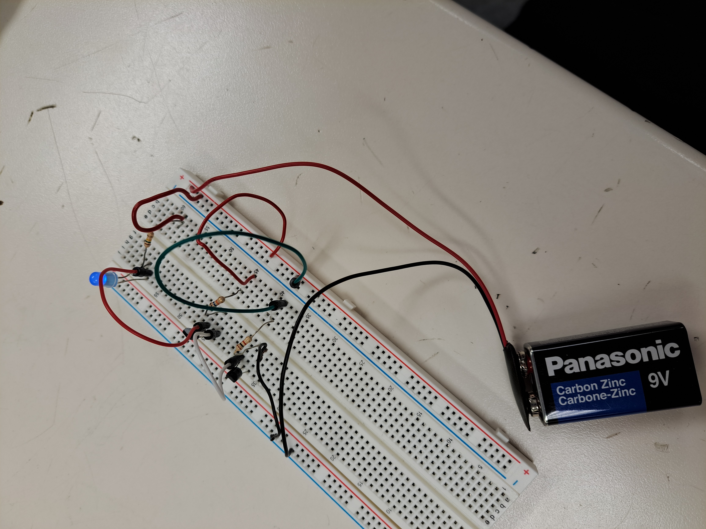
## Demonstration
https://user-images.githubusercontent.com/113391567/223891552-ea61e9cd-a9a5-4bbf-8dc7-edc8c5a7853f.mp4

# Or Gate
## Circut Board
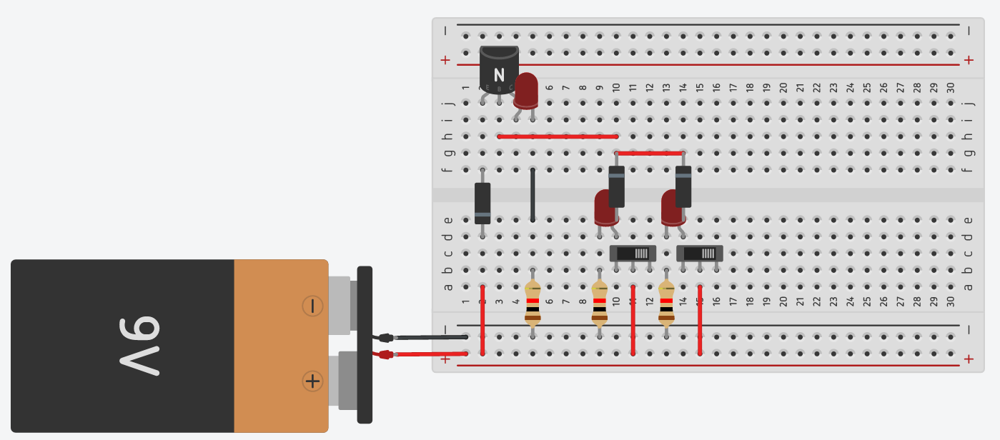
## Wiring Diagram
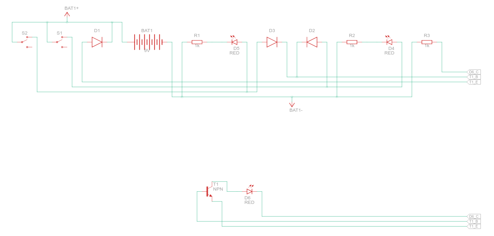
## IRL Circut
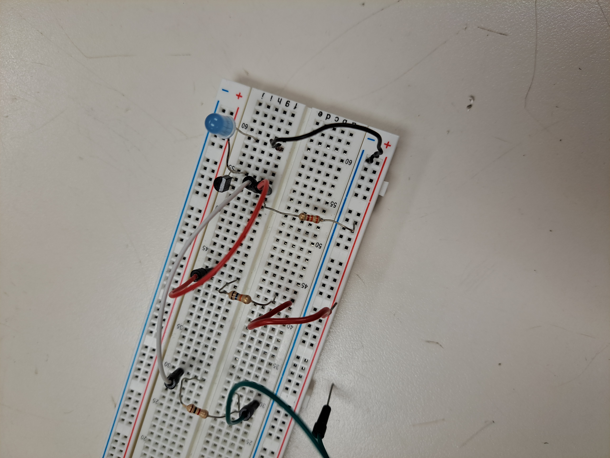
## Demonstration
https://user-images.githubusercontent.com/113391567/223891618-452d93b1-3924-4225-94f7-8113059288ba.mp4

# Nor Gate
## Circut Board

## Wiring Diagram
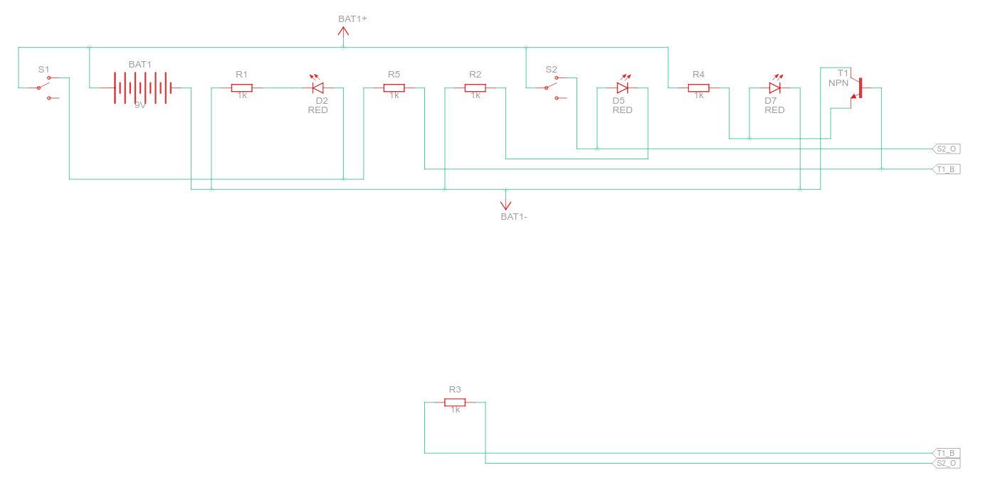
## IRL Circut
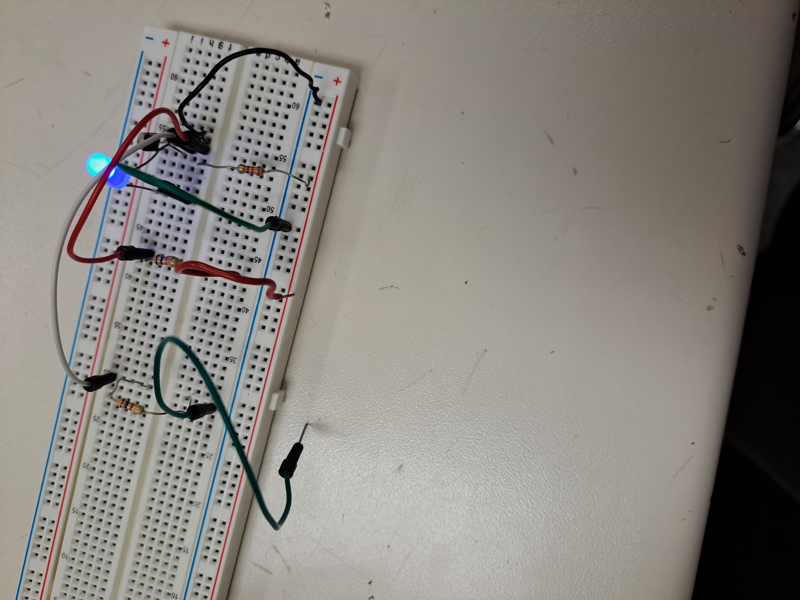
## Demonstration
https://user-images.githubusercontent.com/113391567/223891667-dc52618d-364a-419a-886d-e380520a2b3a.mp4

# Xor Gate
## Circut Board
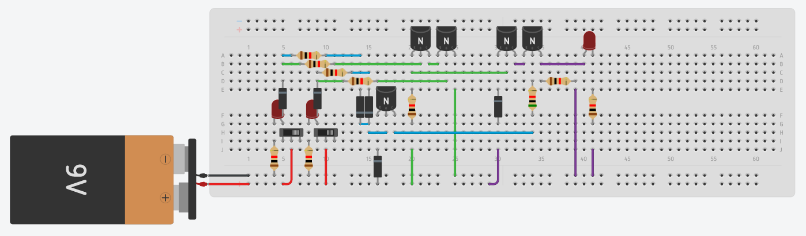
## Wiring Diagram
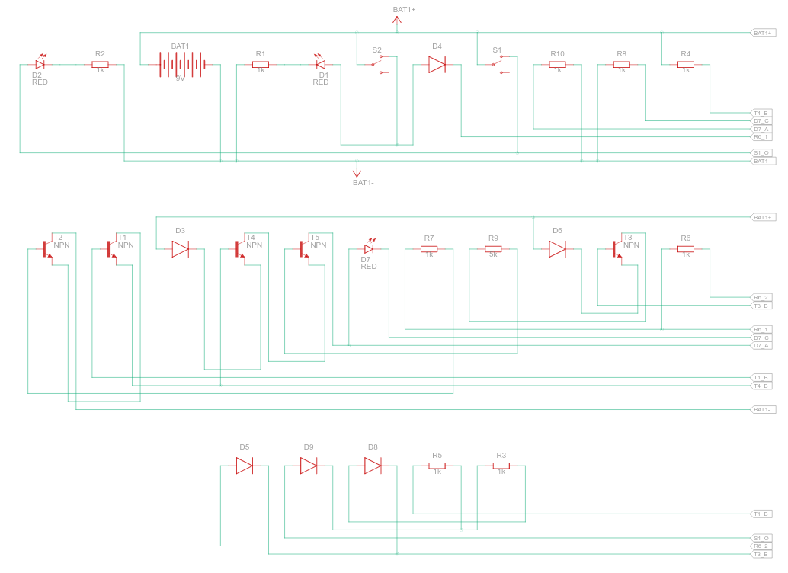
## IRL Circut

## Demonstration
https://user-images.githubusercontent.com/113391567/223891727-2a840af3-c662-4af4-876b-2c427544caef.mp4

# Xnor Gate
## Circut Board
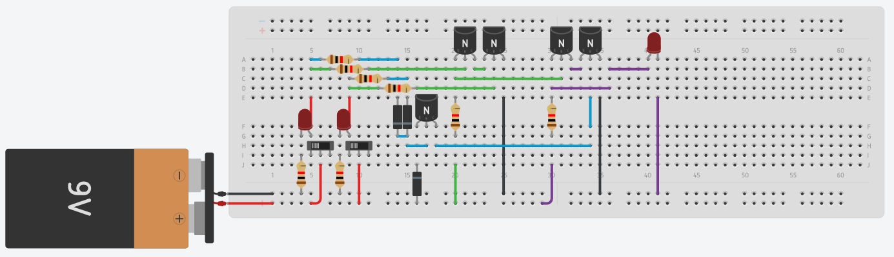
## Wiring Diagram
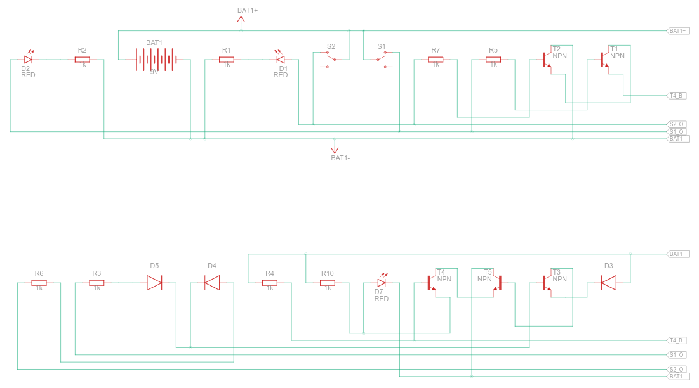
## IRL Circut

## Demonstration
https://user-images.githubusercontent.com/113391567/223891771-0ef6db2f-0b15-40bd-91b8-fd713b226cdc.mp4

# SR Latch Gate
## Circut Board
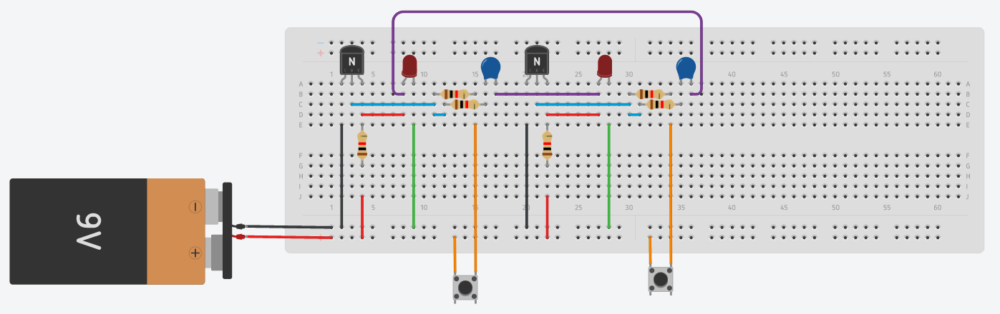
## Wiring Diagram
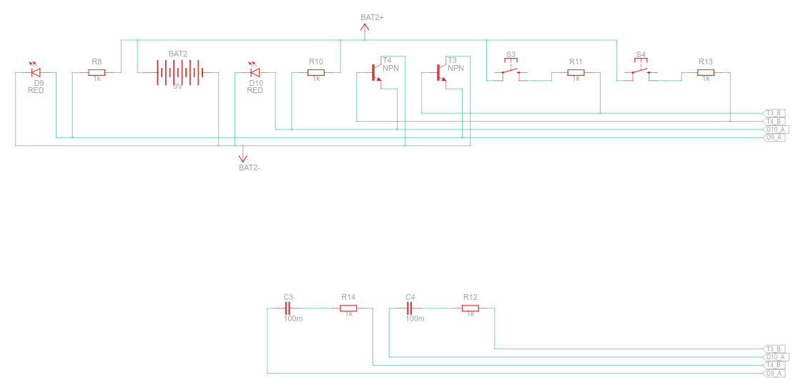
## IRL Circut

## Demonstration
https://user-images.githubusercontent.com/113391567/223891812-8269a793-3f88-4740-857a-e6051e96c916.mp4
