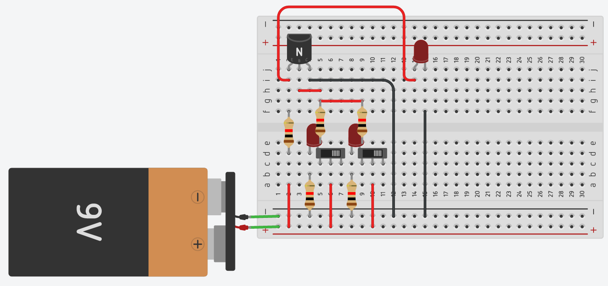

# Not Gate
## Circut Board

## Wiring Diagram

## IRL Circut

## Demonstration

# And Gate
## Circut Board

## Wiring Diagram

## IRL Circut

## Demonstration

# Or Gate
## Circut Board

## Wiring Diagram

## IRL Circut

## Demonstration

# Nor Gate
## Circut Board

## Wiring Diagram

## IRL Circut

## Demonstration

# Xor Gate
## Circut Board

## Wiring Diagram

## IRL Circut

## Demonstration

# Xnor Gate
## Circut Board

## Wiring Diagram

## IRL Circut

## Demonstration

# SR Latch Gate
## Circut Board

## Wiring Diagram

## IRL Circut

## Demonstration

